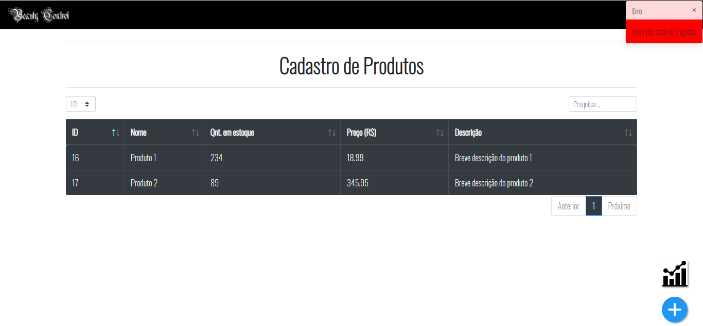
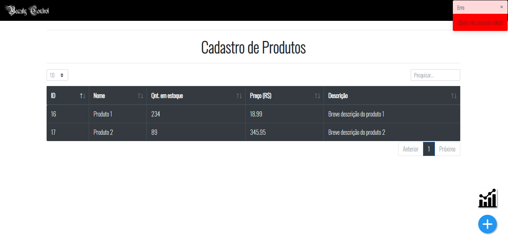
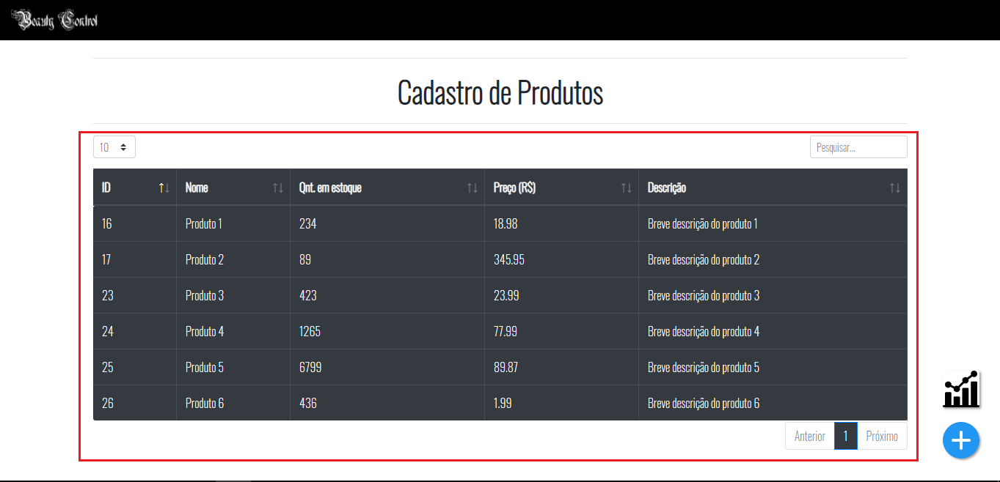
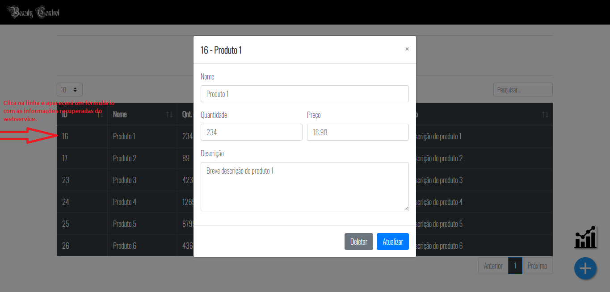
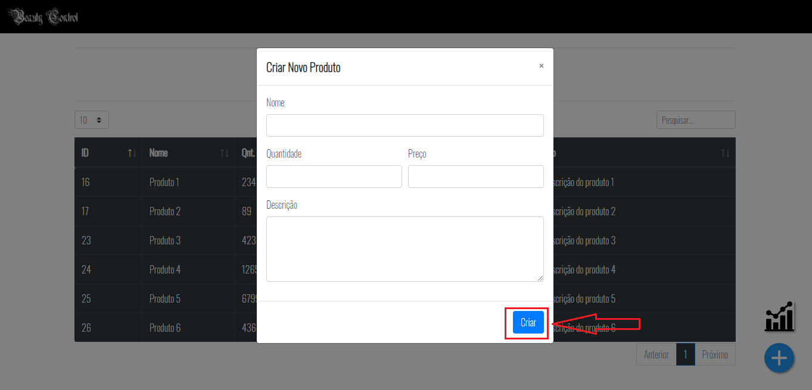
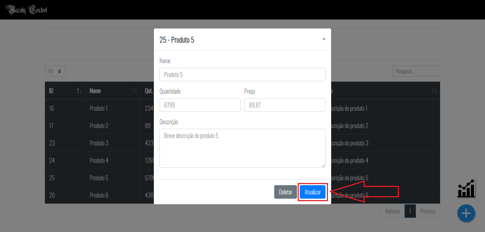
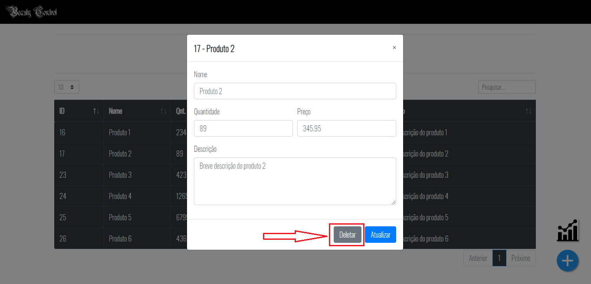
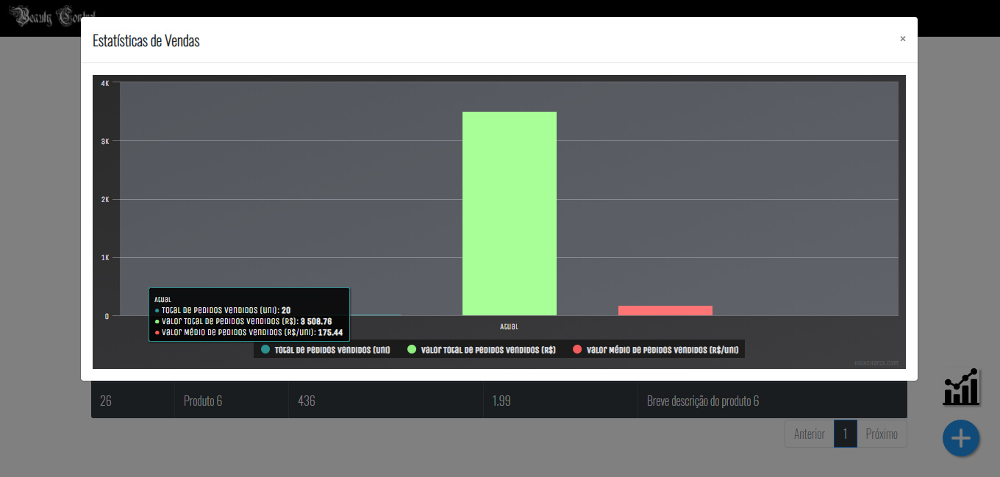

# CE-webservice-woocommerce
O trabalho em questão é da disciplina de CE (Comércio Eletrônico), do curso de graduação de Bacharelado de Sistema de Informação do IFES - Serra, pelo docente Filipe Mutz.

### Informações gerais
- **Autores**: Harã Heique e Joel Will
- **Principais Ferramentas**:  WordPress, WooCommerce, NestJs, TypeORM, MySql, JavaScript, HTML, CSS e Bootstrap
- **Ambiente de desenvolvimento**: Visual Studio Code (versão 1.35.1+)

<p align="center">
    
</p>

O trabalho consiste em prover uma interface RESTful para o sistema de comércio eletrônico voltado para beleza desenvolvido, chamado **Beauty Control**, o qual foi criado através do plugin WooCommerce.
Uma observação importante a ser feita é que ao invés de esta interface ser consumida por uma CLI para alimentar a base de dados do e-commerce, ela é consumimda por uma aplicação cliente web, o qual também será descrita e detalhada ao longo da explicação das etapas deste trabalho.

### 1. Como executar?
Para execução tanto do *web service*, aplicação backend, quanto a da *interface do usuário web*, aplicação frontend, e também do plugin *WooCommerce* (adotada pela dupla), basta seguir os passos seguintes. 

**OBS**.: Todos os testes foram feitos no **Windows 10**.

#### 1.1 WooCommerce
- Para utilizar o WooCommerce basicamente é necessário baixar e iniciar o WAMP ou XAMP, com MySQL e o APACHE, após isto criar um banco de dados utilizado no e-commerce e logo depois baixar e iniciar o Wordpress e por fim instalar o plugin WooCommerce. Para mais detalhes de como utilizar a tecnologia basta seguir este [link](https://drive.google.com/file/d/1WXa7nEO55oRmkdD-6l8sI07nZUfCudiQ/view) que contém um vídeo com todas as etapas realizado na primeira etapa do trabalho.


**OBS**.: Crie um banco com nome **wordpress**, assim como é mostrado no vídeo do link acima.

#### 1.2 Web Service
- Instale o [Node.js](https://nodejs.org/en/);
- Instale o Framework [NestJS](https://nestjs.com/) com o comando:

```console
npm i -g @nestjs/cli
```

- Abra o terminal no diretório **/webservice** dentro do projeto e execute o seguinte comando:

```console
npm install
```

- Em seguida, execute o backend com o comando abaixo:

```console
npm run start
```

Também pode ser utilizado o comando abaixo:

```console
nest start 
```

#### 1.3 Interface Web (Cliente)
- Instale http-server com o comando

```console
npm i -g http-server
```

- Abra o terminal no diretório **/client** dentro do projeto e execute o comando abaixo:

```console
http-server -a localhost -o views/index.html
```

Após executar o comando acima irá abrir automaticamente a interface no seu navegador padrão na url http://localhost:8080/views/index.html.

**OBS.:** Caso ocorra um erro de SSL no Google Chrome (redireciona automaticamente de http para https) execute os passos do link: https://stackoverflow.com/questions/25277457/google-chrome-redirecting-localhost-to-http.


### 2. Controle à falhas
No web service nas seguintes situações são realizados os controles de falhas: 

**OBS.:** Algo importante a ressaltar que as falhas ocorridas e capturadas pelo web service são apresentadas para o usuário de forma amigável na interface cliente a partir de toasts, as quais aparecem no canto superior direito, melhorando assim a experiência do usuário.

- Na inserção e atualização de produtos, caso o valor ou a quantidade forem negativos como é mostrado na imagem abaixo.

<p align="center">
    
</p>

- Em qualquer operação que receba um identificador, se o identificador não existir na base de dados como é mostrado na imagem abaixo.

<p align="center">
    
</p>

### 3. Requisições ao web service
Ao contrário do que foi proposto, como dito anteriormente, foi criado uma interface web para facilitar tanto nos testes e consumo mais mais fácil e amigável possível ao usuário. Logo abaixo contém imagens com suas respectivas explicações de cada teste solicitado no trabalho.

#### 3.1 Listar todos os produtos
Para listar todos os produtos na interface é realizada a requisição **HTTP GET** no endpoint `http://localhost/webservice/produto` assim que o *DOM (Document Object Model)* página é carregada. A imagem abaixo mostra uma tabela que é responsável por apresentar todos os produtos recuperados do web service.

<p align="center">
    
</p>

#### 3.2 Listar um único produto
Para listar um único produto basta clicar em uma das linhas da tabela que será realizado uma requisição **HTTP GET** no endpoint `http://localhost/webservice/produto/{id}` mostrando assim um formulário preenchido com as informações da linha clicada, como é mostrado na imagem abaixo.

<p align="center">
    
</p>

#### 3.3 Inserir produto
Para inserir um produto basta clicar no botão flutuante azul no canto inferior à direita, onde será apresentado um formulário para ser preenchido. Após isto basta clicar no botão CRIAR e será realizado uma requisição **HTTP POST** com os dados para o endpoint `http://localhost/webservice/produto`.

<p align="center">
    
</p>

#### 3.4 Atualizar produto
Para atualizar um produto basta clicar em uma das linhas desejada da tabela, onde será apresentado um formulário com os dados preenchidos. Após isto basta clicar no botão de coloração azul chamado ATUALIZAR e será realizado uma requisição **HTTP PUT** com os dados para o endpoint `http://localhost/webservice/produto/{id}`.

<p align="center">
    
</p>

#### 3.5 Remover produto
Para remover um produto basta clicar em uma das linhas desejada da tabela, onde será apresentado um formulário com os dados preenchidos. Após isto basta clicar no botão de coloração cinza chamado DELETAR e será realizado uma requisição **HTTP DELETE** para o endpoint `http://localhost/webservice/produto/{id}`.

<p align="center">
    
</p>

#### 3.6 Obter estatísticas de vendas
Por fim para obter as estatítiscas de vendas basta clicar no botão flutuante no canto inferior à direita, que contém um desenho de um gráfico, e será mostrado um modal contendo dentro dele um gráfico com os dados obtidos da requisição **HTTP GET** no endpoint `http://localhost/webservice/stats`, como é mostrado na imagem abaixo.

<p align="center">
    
</p>

### 4. Tabelas e queries utilizadas
Abaixo é apresentado uma tabela com as requisições e suas respectivas tabelas e raw queries utilizadas para as funcionalidades da aplicação:

Funcionalidade|Verbo HTTP|Tabelas|Query
---|---|---|---
**Listar produtos**|GET|wp_posts, wp_wc_product_meta_lookup|SELECT ID AS id, post_title AS nome, post_excerpt AS descricao, min_price AS preco, stock_quantity AS qtdEstoque FROM wp_posts AS p INNER JOIN wp_wc_product_meta_lookup AS pm ON pm.product_id = p.id WHERE pm.product_id IS NOT NULL;
**Listar produto**|GET|wp_posts, wp_wc_product_meta_lookup|SELECT ID AS id, post_title AS nome, post_excerpt AS descricao, min_price AS preco, stock_quantity AS qtdEstoque FROM wp_posts AS p INNER JOIN wp_wc_product_meta_lookup AS pm ON pm.product_id = p.id WHERE id = @id;
**Inserir produto**|POST|wp_posts, wp_wc_product_meta_lookup, wp_postmeta|INSERT INTO wp_posts (post_title, post_excerpt, post_type, post_date, post_date_gmt, post_modified, post_modified_gmt, post_content, to_ping, pinged, post_content_filtered) VALUES '@produto.nome', '@produto.descricao','product', NOW(), UTC_TIMESTAMP(), NOW(), UTC_TIMESTAMP(), '', '', '', '');</br>INSERT INTO wp_wc_product_meta_lookup (product_id, min_price, stock_quantity) VALUES (response.insertId}, @produto.preco, @produto.qtdEstoque;</br>INSERT INTO wp_postmeta (post_id, meta_key, meta_value) VALUES (@response.insertId, '_price', @produto.preco);</br>INSERT INTO wp_postmeta (post_id, meta_key, meta_value) VALUES @response.insertId,'_stock', @produto.qtdEstoque;</br>INSERT INTO wp_postmeta (post_id, meta_key, meta_value) VALUES (@response.insertId,'_manage_stock', 'yes');
**Atualizar produto**|PUT|wp_posts, wp_wc_product_meta_lookup, wp_postmeta|UPDATE wp_posts SET post_title = @produto.nome, post_excerpt = @produto.descricao;</br>UPDATE wp_wc_product_meta_lookup SET min_price = @produto.preco, stock_quantity = @produto.qtdEstoque WHERE product_id = @produto.id;</br>UPDATE wp_postmeta SET meta_value = @produto.preco WHERE post_id = @produto.id AND meta_key = '_price';</br>UPDATE wp_postmeta SET meta_value = @produto.qtdEstoque WHERE post_id = @produto.id AND meta_key = '_stock';
**Remover produto**|DELETE|wp_posts, wp_wc_product_meta_lookup, wp_postmeta|DELETE FROM wp_posts WHERE id = @id;<br>DELETE FROM wp_wc_product_meta_lookup WHERE product_id = @id;<br>DELETE FROM wp_postmeta WHERE post_id = @id;
**Obter estatísticas**|GET|wp_wc_order_product_lookup|SELECT aux.qtd AS totalPedidosVendidos, aux.valor AS valorTotalPedidosVendidos, aux.valor / aux.qtd AS valorMedioPedidosVendidos FROM (SELECT SUM(product_qty) AS qtd, SUM(product_gross_revenue) AS valor FROM wp_wc_order_product_lookup) AS aux;

### 4. Explicação breve das queries
Abaixo é apresentado uma tabela com a explicação das queries que utilizadas para as funcionalidades da aplicação:

Funcionalidade|Explicação
---|---
**Listar produtos**|Busca parte das informações todos os produtos na tabela wp_post e a outra parte na tabela wp_wc_product_meta_lookup relacionada a cada produto, usando um JOIN. A tabela wp_wc_product_meta_lookup é usada apenas para facilitar a busca das informações, mas não faz com que os dados nela apareçam na plataforma do WooCommerce.
**Listar produto**|Funciona da mesma forma que a querie de **Listar Produtos**, mas usa um **WHERE** para buscar apenas informações do produto desejado.
**Inserir produto**|São feitas varias inserções em tabelas diferentes com propositos diferentes. Primeiro insere o nome e a descrição na tabela **wp_posts**, indicando que é um produto e passando vários valores padrões que não são usados pelo o WooCommerce. Em seguida, insere o preço e o estoque na tabela **wp_wc_product_meta_lookup** com o intuito de faciltar o resgate das informações. Depois se faz várias inserções na tabela **wp_postmeta**, começando com uma linha para o preço, mais outra linha para a quantidade de estoque. Por fim, outra linha para indicar que se deseja gerenciar o estoque, caso não seja feito essa indicação, não aparece o estoque na interface. **OBS** A tabela **wp_postmeta** que é usada de fato pelo WooCommerce para exibir as informações para o usuário.
**Atualizar produto**|É feito uma querie de **UPDATE** para cada tabela que foi feita inserção de dados sobre o produto, mas não é feito atualização dos valores default da tabela **wp_posts** e nem na linha que indica se o estoque deve ser gerenciado ou não.
**Remover produto**|São feitas 3 **DELETEs** uma em cada tabela que possui informações do produto, apagando apenas o produto que foi passado o **Id**
**Obter estatísticas**|Busca primeiro a soma da quantidade de produtos vendidos e do valor total dos produtos vendidos, depois divide um pelo outro e obtem a média do valor dos produtos vendidos

### Informações adicionais
- Para que apareça valores no **stats**, é preciso fazer uma ou várias compras no WooCommerce. Recomendamos ativar o metódo de pagamento **"Pagar na entrega"**, já não exige configurações adicionais, mas qualquer outra forma de pagamento que se desejar, também irá funcionar.
Todo o código fonte está hospedado no [GitHub](https://github.com/HaraHeique/CE-webservice-woocommerce).


  


